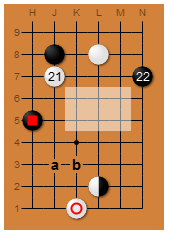

# bamboojoint
> Automatically exported from code.google.com/p/bamboojoint

A JavaScript renderer that creates Go game diagrams from SL markup

BambooJoint uses the HTML5 Canvas to create diagrams of Go game situations from plain text markup as made popular by Sensei's Library (SL). Just for the record: It's neither endorsed by nor affiliated with SL.

BambooJoint was created for displaying static Go game situations on the Game of Go Stack Exchange site, which was later merged into the Board and Card Games Stack Exchange. It is not as feature complete as the server-side renderer used by SL. For example, the following do not work:

- arrows
- SGF file creation
- links in diagrams
- It also behaves differently in certain edge cases. It's mainly made for nice, static, rectangular board diagrams; nothing more.

## Usage

Include the file ```bamboojoint.js``` in your page.

```javascript
var result = BambooJoint.render(source);
```

If source is not legal board markup, or if the browser doesn't support the HTML5 canvas, this returns ```null```. Otherwise, it returns an object with a property ```result.canvas```, which is a ```<canvas>``` DOM element, properties ```result.width``` and ```result.height``` that give the dimensions of the canvas in pixels, and optionally -- if given in the markup source -- a property ```result.caption```.

The following source:

```
$$Wc13m21 This is the caption.
$$ . . . . . . |
$$ . X . O . . |
$$ . 1 . . . 2 |
$$ . . ? ? ? . |
$$ # . ? ? ? . |
$$ . . , . . . |
$$ . a b . . . |
$$ . . . * . . |
$$ . . W . . . |
$$ ------------
```

will be rendered like this:



Have a look at demo.html to play around with it.
